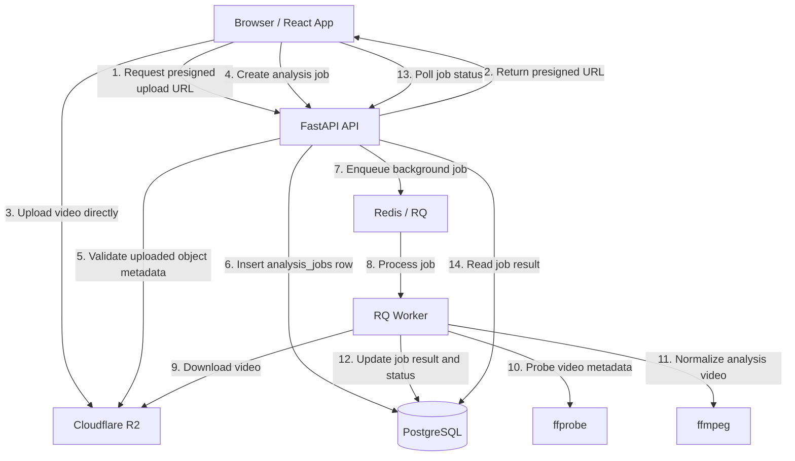
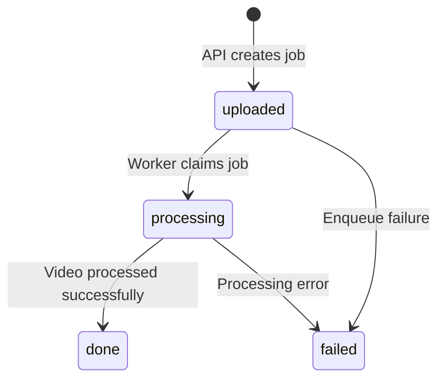

# Yukiguni

English | [繁體中文](./README.zh-TW.md)

Yukiguni is a running video analysis MVP. Its focus is building a deployable video-processing pipeline: users upload running videos from the browser, the system creates analysis jobs, a background worker downloads the videos, reads video metadata, normalizes them into an analysis-ready format, and writes the processing result back to the database.

The project currently focuses on video upload, asynchronous processing, job lifecycle management, and deployment integration. MediaPipe pose analysis, overlay rendering, permanent output videos, and shareable result pages are still planned.

## Demo

- Demo video: TODO
- Frontend: TODO
- API health check: TODO

## What Is Implemented

- Users can select a video from the frontend
- The frontend requests a presigned upload URL from the API
- Videos are uploaded directly to Cloudflare R2 without passing through the API server
- The API creates an `analysis_jobs` record
- The API enqueues background work into Redis / RQ
- The worker downloads the video
- The worker uses `ffprobe` to read original video metadata
- The worker uses `ffmpeg` to normalize the video into a CFR MP4 analysis video
- The worker writes video metadata, normalization metadata, and job status back to PostgreSQL
- The frontend can poll job status and display either the successful result or a failure state

## System Flow



## Tech Stack

### Backend / Worker

- Python 3.12
- FastAPI
- PostgreSQL
- Alembic
- Redis
- RQ
- Cloudflare R2
- `ffprobe` / `ffmpeg`
- Docker
- Ruff

### Frontend

- Vite
- React
- TypeScript
- React Router
- Mantine
- ESLint

### Deployment

- Frontend: Cloudflare Pages
- API: Render Web Service
- Worker: Render Background Worker
- Database: Render PostgreSQL
- Queue: Render Key Value / Redis-compatible service
- Object Storage: Cloudflare R2

## Project Structure

```text
apps/
  api/
    app/
      api/       FastAPI routes, schemas, API-side DB access
      core/      settings, shared constants, shared enums
      services/  R2 access, video probing, normalization, result building
      workers/   RQ setup, worker orchestration, job state transitions
    alembic/     database migrations

  web/
    src/
      app/       app-level routes
      pages/     route page components
      features/  pipeline-check feature
      lib/       app-level config
```

## Job Lifecycle



## Engineering Highlights

This project is not just a CRUD app. It implements a media-processing pipeline that is close to what a real product would need:

- Uses presigned URLs to keep large video uploads away from the API server
- Keeps the API request cycle lightweight and delegates heavy work to a background worker
- Uses a queue to decouple the API from video processing
- Stores job lifecycle and processing results in PostgreSQL
- Protects worker state transitions to avoid duplicated processing and polluted data
- Uses `ffprobe` / `ffmpeg` to create standardized video input for future pose analysis
- Containerizes the API and worker with Docker so runtime dependencies like `ffprobe` / `ffmpeg` are more consistent across deployment environments

## Current Limitations

- MediaPipe pose analysis is not integrated yet
- Overlay video generation is not implemented yet
- The normalized analysis video is currently a temporary worker file and is not persisted back to R2 yet
- User accounts, shareable result pages, and a polished product UI are not implemented yet
- The current frontend is mainly a pipeline check / deployment check UI

## Local Development

### API

```bash
cd apps/api
uv sync
uv run alembic upgrade head
uv run uvicorn app.api.main:app --reload
```

### Worker

```bash
cd apps/api
uv run rq worker analysis-jobs
```

### Web

```bash
cd apps/web
npm install
npm run dev
```

## Verification

### API

```bash
cd apps/api
uv run ruff check .
uv run python -m py_compile app/**/*.py alembic/env.py alembic/versions/*.py
```

### Web

```bash
cd apps/web
npm run lint
npm run build
```

## Roadmap

- Integrate MediaPipe Pose Landmarker
- Define structured running-form analysis result
- Generate processed videos with visual overlays
- Store processed outputs in Cloudflare R2
- Add shareable result pages
- Add retry support for failed jobs
