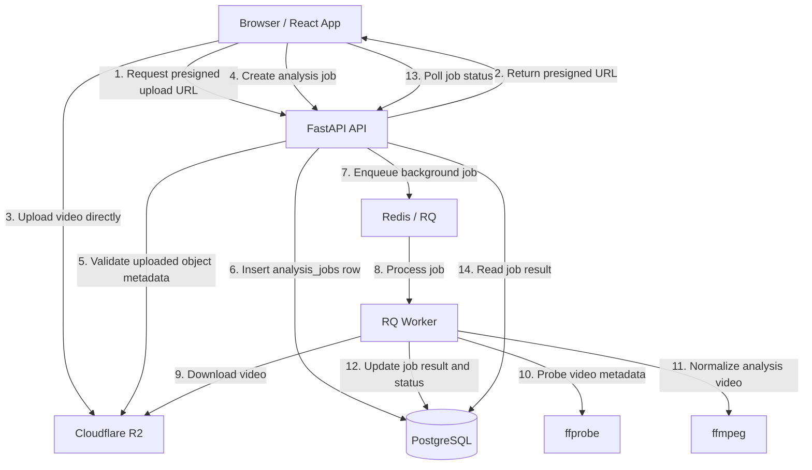
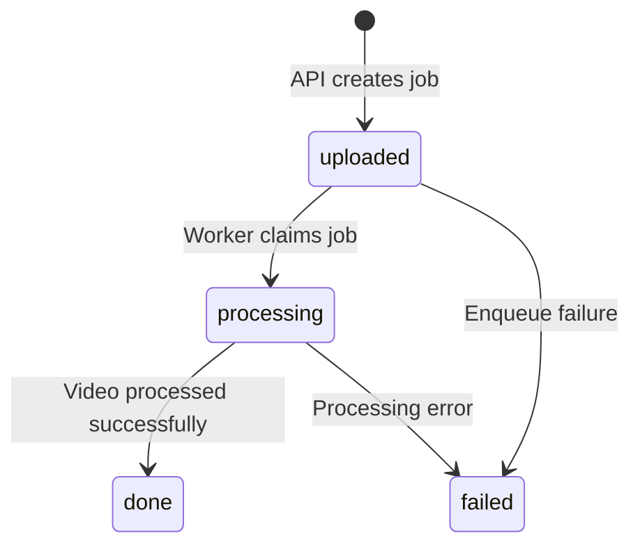

# Yukiguni

[English](./README.md) | 繁體中文

Yukiguni 是一個跑步影片分析 MVP，重點是建立一條可部署的影片處理 pipeline：使用者從瀏覽器上傳跑步影片，系統建立分析任務，背景 worker 下載影片、讀取影片 metadata、normalize 成分析用影片格式，並把處理結果寫回資料庫。

目前專案聚焦在影片上傳、非同步處理、job lifecycle 與部署整合。MediaPipe 姿態分析、overlay rendering、永久輸出影片與分享頁面仍在規劃中。

## Demo

### 1. Upload and Processing Pipeline

https://github.com/user-attachments/assets/e092565a-d06f-4a9a-9ee8-d06e1fb219c3

這段 demo 展示內部 pipeline-check UI 的端到端上傳流程：選擇影片、向 API 要求 presigned upload URL、將檔案直接上傳到 Cloudflare R2、建立 analysis job，並等待背景 worker 執行處理。

### 2. Pose Debug Viewer

https://github.com/user-attachments/assets/68229002-81e9-47d7-8214-4bd1692dc874

這段 demo 展示既有 analysis job 的 pose debug 頁面。頁面會載入 normalized analysis video 與 pose landmark data，並在影片上繪製和 frame 同步的 debug overlay，用來檢查 MediaPipe pose detection 結果。

## 目前已完成

- 使用者從前端選擇影片
- 前端向 API 要求 presigned upload URL
- 影片直接上傳到 Cloudflare R2，不經過 API server
- API 建立 `analysis_jobs` 任務資料
- API 將背景工作 enqueue 到 Redis / RQ
- Worker 下載影片
- Worker 使用 `ffprobe` 讀取原始影片 metadata
- Worker 使用 `ffmpeg` normalize 成 CFR MP4 analysis video
- Worker 將影片 metadata、normalization metadata 與 job status 寫回 PostgreSQL
- 前端可以 polling job status，並顯示成功結果或失敗狀態

## 系統流程



## 技術棧

### Backend / Worker

- Python 3.12
- FastAPI
- PostgreSQL
- Alembic
- Redis
- RQ
- Cloudflare R2
- `ffprobe` / `ffmpeg`
- Docker
- Ruff

### Frontend

- Vite
- React
- TypeScript
- React Router
- Mantine
- ESLint

### Deployment

- Frontend: Cloudflare Pages
- API: Render Web Service
- Worker: Render Background Worker
- Database: Render PostgreSQL
- Queue: Render Key Value / Redis-compatible service
- Object Storage: Cloudflare R2

## 專案結構

```text
apps/
  api/
    app/
      api/       FastAPI routes、schemas、API-side DB access
      core/      settings、shared constants、shared enums
      services/  R2 access、video probing、normalization、result building
      workers/   RQ setup、worker orchestration、job state transitions
    alembic/     database migrations

  web/
    src/
      app/       app-level routes
      pages/     route page components
      features/  pipeline-check feature
      lib/       app-level config
```

## Job Lifecycle



## 工程重點

這個專案不是單純的 CRUD app，而是實作了一條接近真實產品會需要的 media-processing pipeline：

- 使用 presigned URL，避免大影片經過 API server
- API request cycle 只做輕量驗證，重工作交給 background worker
- 用 queue 解耦 API 與影片處理流程
- 用 PostgreSQL 保存 job lifecycle 與處理結果
- Worker state transition 有狀態保護，避免重複處理污染資料
- 使用 `ffprobe` / `ffmpeg` 建立後續姿態分析所需的標準化影片輸入
- API 與 worker 使用 Docker containerize，讓 `ffprobe` / `ffmpeg` 這類 runtime dependency 在部署環境中更一致

## 目前限制

- 尚未整合 MediaPipe pose analysis
- 尚未產生 overlay video
- Normalized analysis video 目前是 worker 暫存檔，尚未永久存回 R2
- 尚未實作使用者帳號、分享頁面或正式產品 UI
- 目前前端主要是 pipeline check / deployment check UI

## Local Development

### API

```bash
cd apps/api
uv sync
uv run alembic upgrade head
uv run uvicorn app.api.main:app --reload
```

### Worker

```bash
cd apps/api
uv run rq worker analysis-jobs
```

### Web

```bash
cd apps/web
npm install
npm run dev
```

## Verification

### API

```bash
cd apps/api
uv run ruff check .
uv run python -m py_compile app/**/*.py alembic/env.py alembic/versions/*.py
```

### Web

```bash
cd apps/web
npm run lint
npm run build
```

## Roadmap

- Integrate MediaPipe Pose Landmarker
- Define structured running-form analysis result
- Generate processed videos with visual overlays
- Store processed outputs in Cloudflare R2
- Add shareable result pages
- Add retry support for failed jobs
